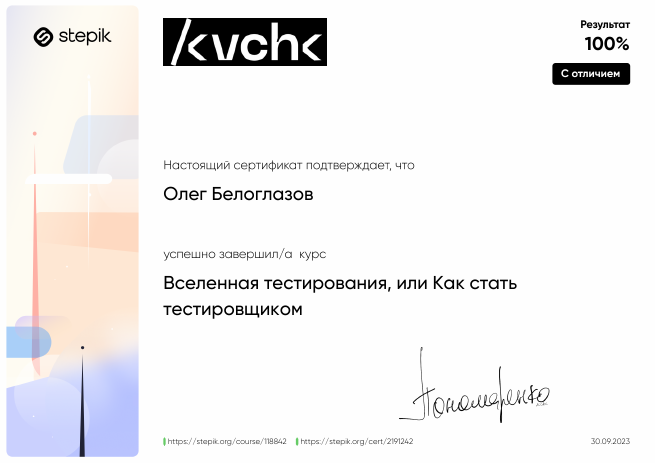

<h1 align="center">Привет! Я Белоглазов Олег</a> 
</h1>

<h3 align="center">QA-engineer</h3>

### QA:
#### Репозиторий домашних заданий
https://github.com/mazzdriver/postman

### Сертификаты курсов:

    
Python

    

    
Тестирование

    

    
Postman

    

    
КМБ ))))0)0)

    

<!---
mazzdriver/mazzdriver is a ✨ special ✨ repository because its `README.md` (this file) appears on your GitHub profile.
You can click the Preview link to take a look at your changes.
--->
