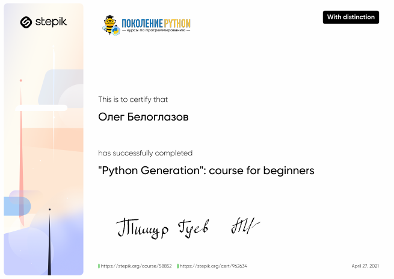
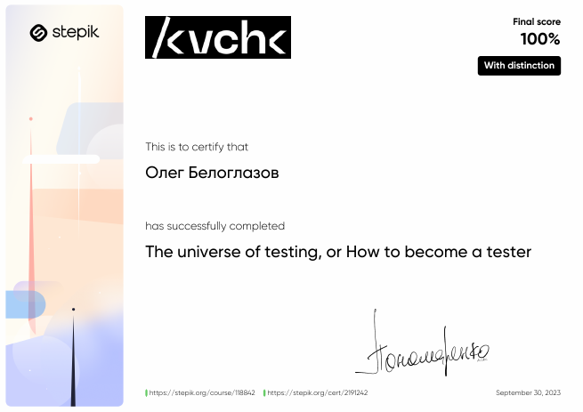
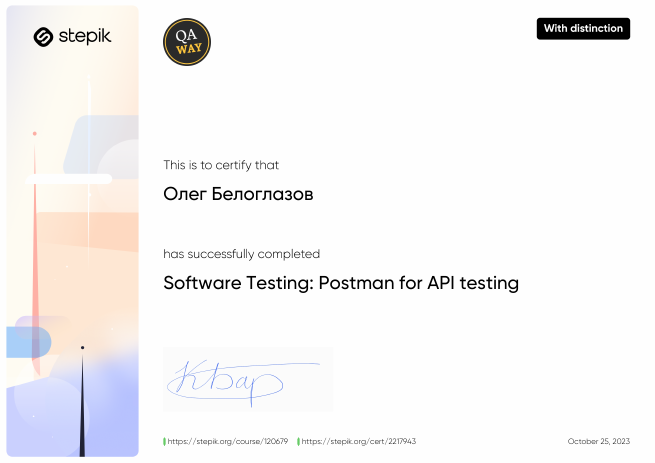
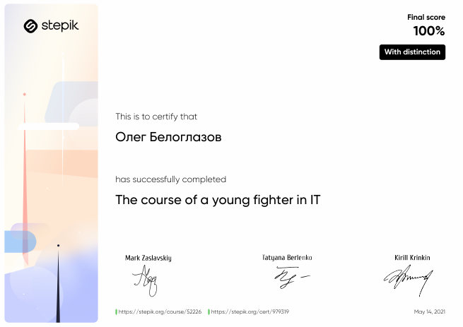

<h1 align="center">Hello, I'm Beloglazov Oleg</a> 
</h1>

<h3 align="center">QA-engineer</h3>

### QA:
#### Repository with homeworks
https://github.com/mazzdriver/postman

### Sertificates:

    
Python

    

    
Testing

    

    
Postman

    

    
Basic training hahaha

    

<!---
mazzdriver/mazzdriver is a ✨ special ✨ repository because its `README.md` (this file) appears on your GitHub profile.
You can click the Preview link to take a look at your changes.
--->
